# CI/CD Pipeline using Jenkins, GitHub & Docker Hub
---

#  Aim

To design and implement a complete CI/CD pipeline using Jenkins by integrating GitHub and Docker Hub.

---

#  Objectives

* Understand CI/CD workflow
* Automate build and deployment
* Integrate GitHub, Jenkins, and Docker Hub
* Use Webhooks for automation

---

#  Tools Used

* Jenkins
* GitHub
* Docker
* Docker Hub
* Flask

---

#  Project Structure

```
my-app/
├── app.py
├── requirements.txt
├── Dockerfile
├── Jenkinsfile
```

---

#  Step-by-Step Implementation

---

##  Step 1: Create Project in VS Code

* Created folder `my-app`
* Added files:

  * `app.py`
  * `requirements.txt`
  * `Dockerfile`
  * `Jenkinsfile`

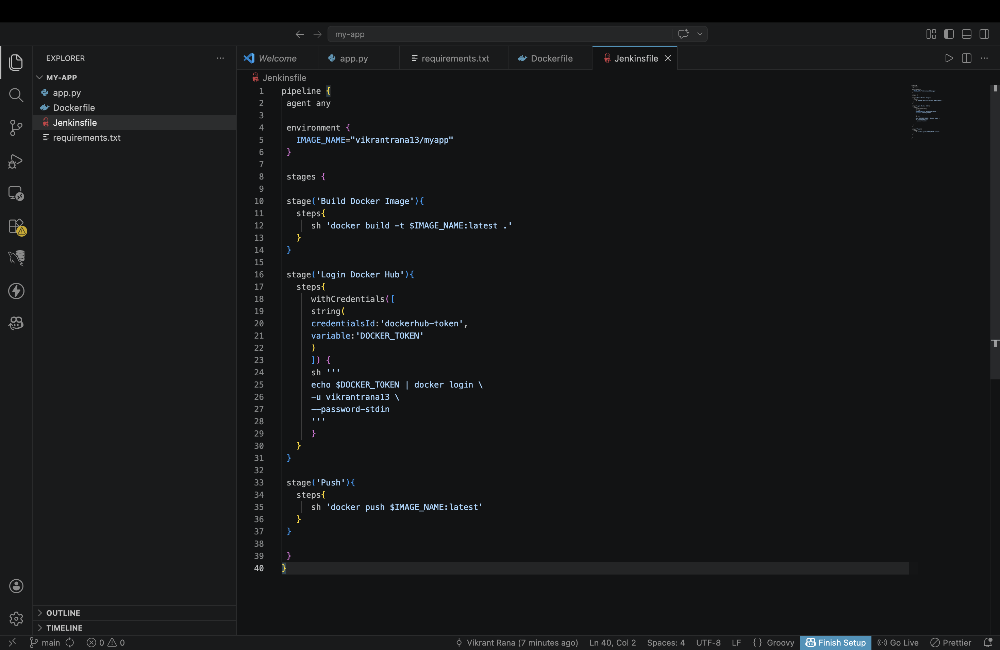

---

##  Step 2: Write Application Code

```python
from flask import Flask
app = Flask(__name__)

@app.route("/")
def home():
    return "Hello from CI/CD  Pipeline!"

if __name__=="__main__":
    app.run(host="0.0.0.0", port=80)
```


---

##  Step 3: Create GitHub Repository

* Created repo: `my-app`
* Pushed code using Git commands

```bash
git init
git add .
git commit -m "initial commit"
git push
```

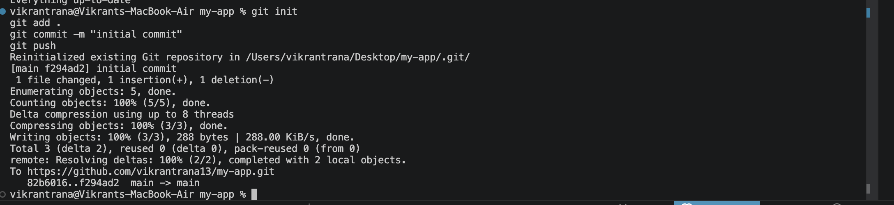

---

## Step 4: Setup Jenkins using Docker

* Created `docker-compose.yml`
* Started Jenkins container

```bash
docker-compose up -d
```

* Accessed Jenkins at:
  `http://localhost:8080`

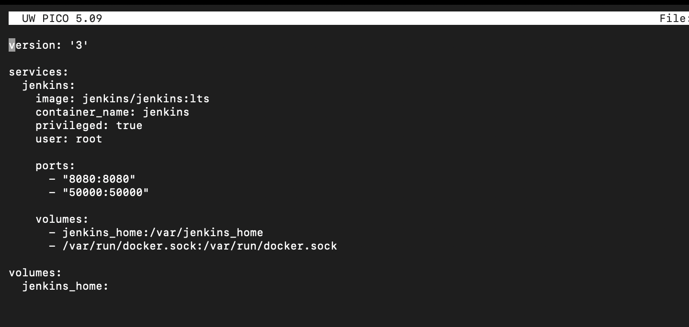
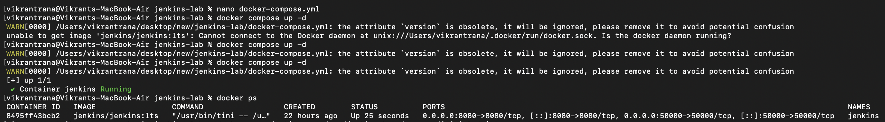
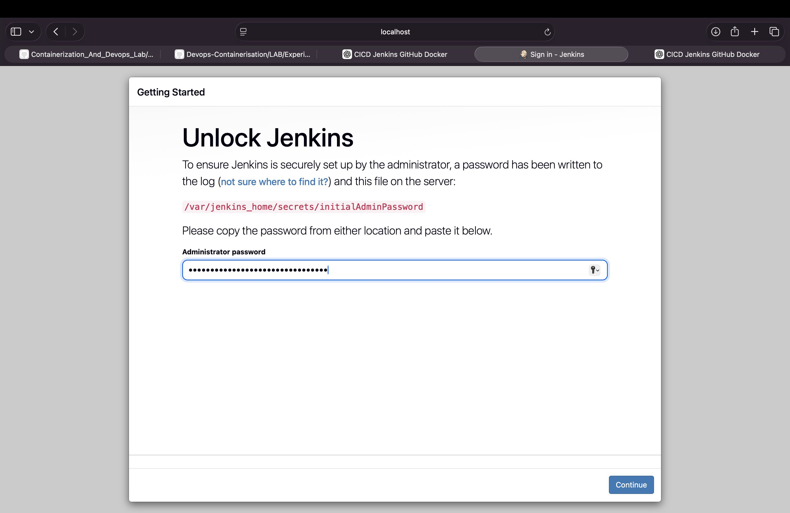
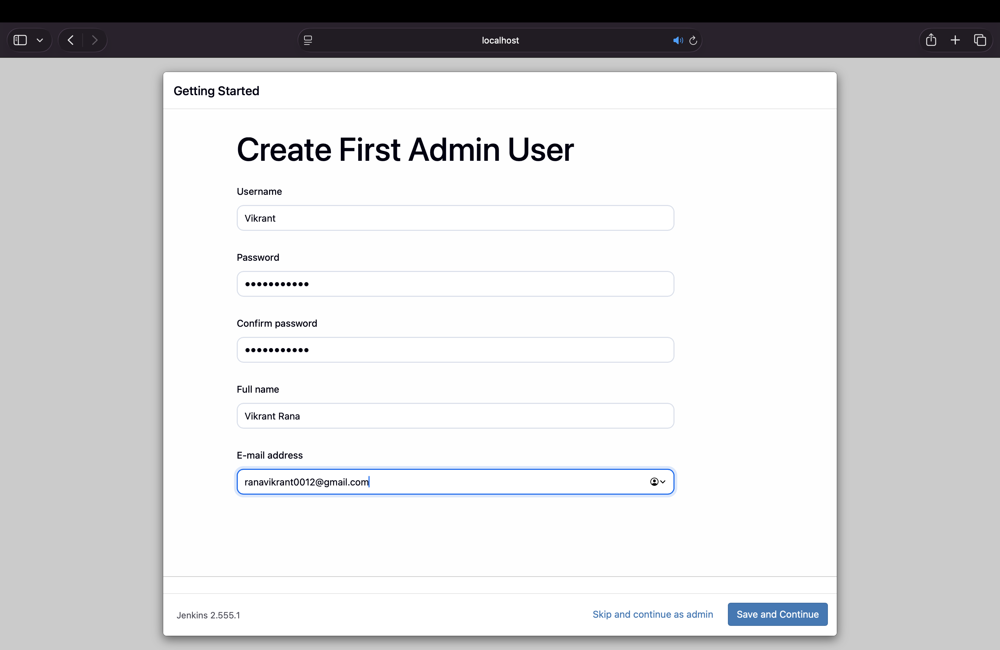
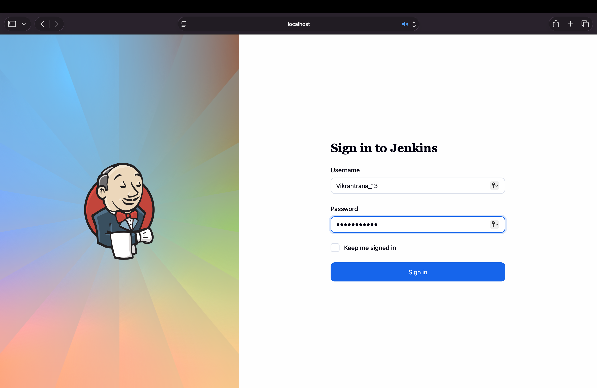
---

## Step 5: Configure Jenkins

### ➤ Add Credentials

* Added Docker Hub token
* ID: `dockerhub-token`
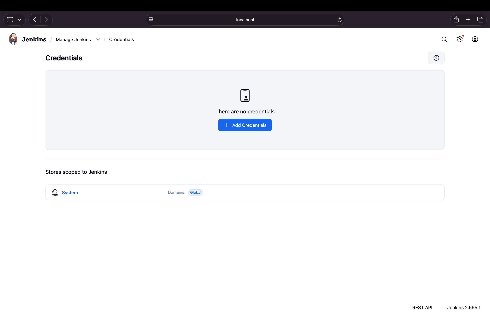
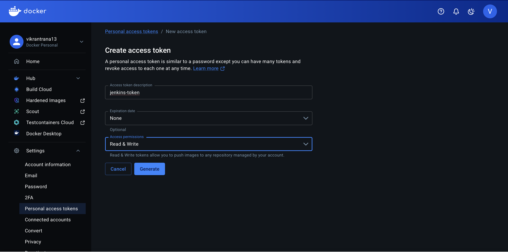
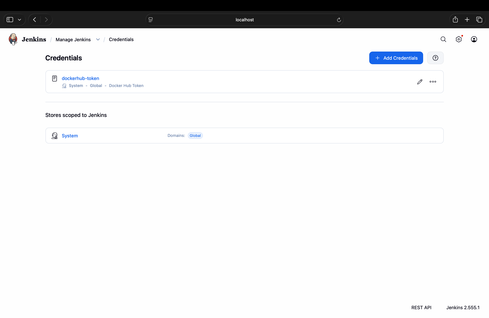


### ➤ Create Pipeline Job

* Selected: **Pipeline script from SCM**
* Repo URL: `https://github.com/vikrantrana13/my-app.git`
* Script Path: `Jenkinsfile`

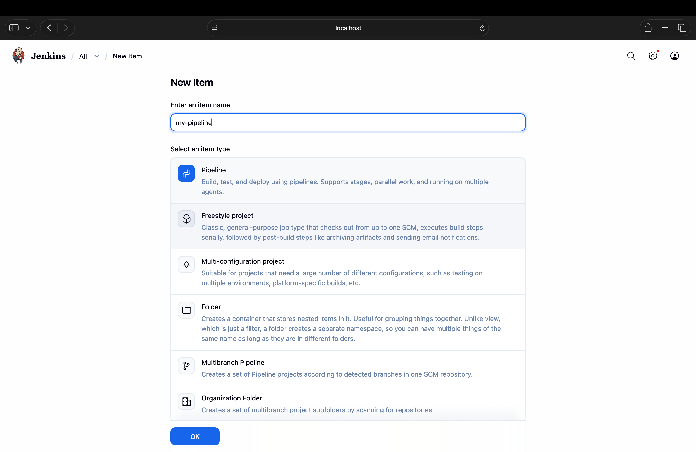
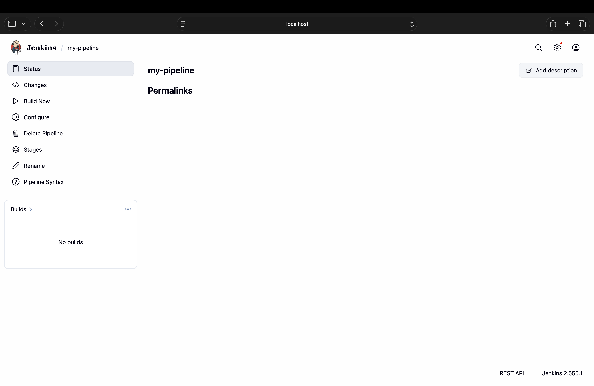

---

##  Step 6: Setup Webhook

* Added webhook in GitHub
* Payload URL:

```
https://your-ngrok-url/github-webhook/
```

* Enabled push events

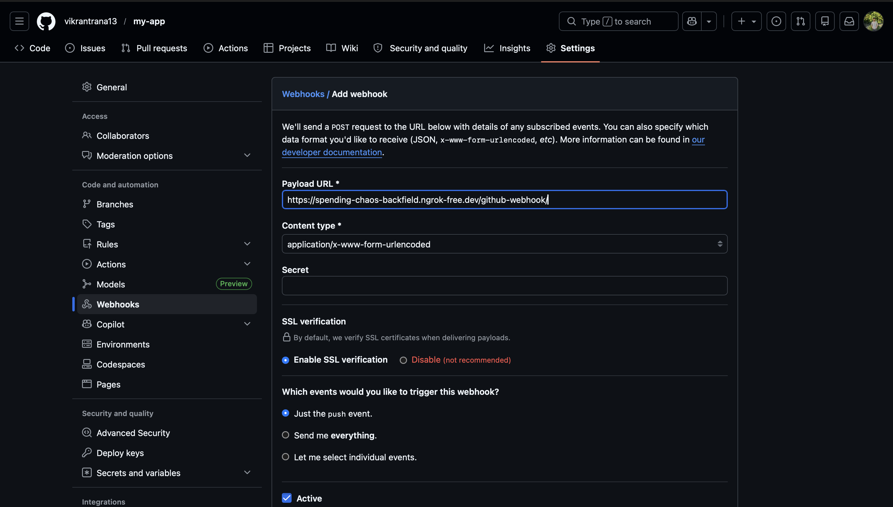

---

##  Step 7: Execute Pipeline

* Pushed code to GitHub
* Jenkins triggered automatically

### Stages executed:

* Clone Source
* Build Docker Image
* Login to Docker Hub
* Push Image

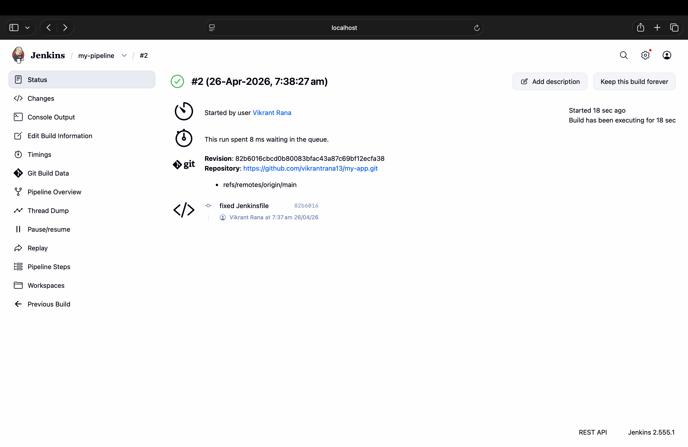

---

## Step 8: Verify on Docker Hub

* Image: `vikrantrana13/myapp`
* Tag: `latest`
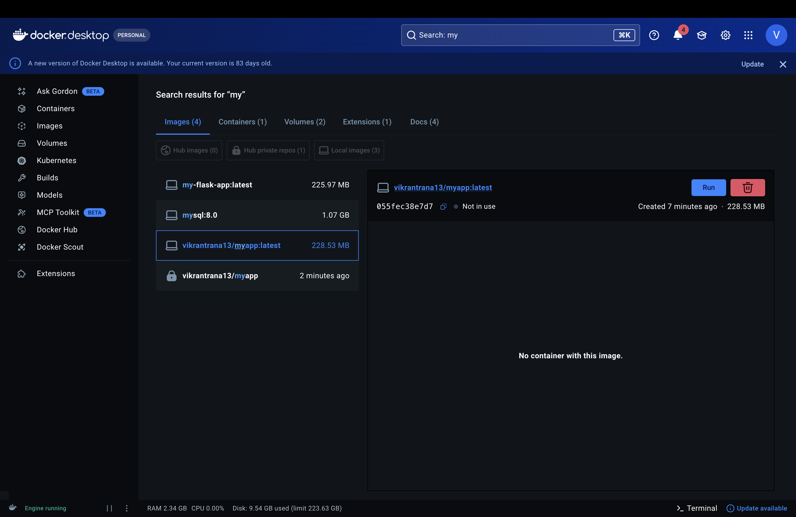

---

## Step 9: Run Docker Container

```bash
docker run -d -p 8081:80 vikrantrana13/myapp
```

Open:

```
http://localhost:8081
```
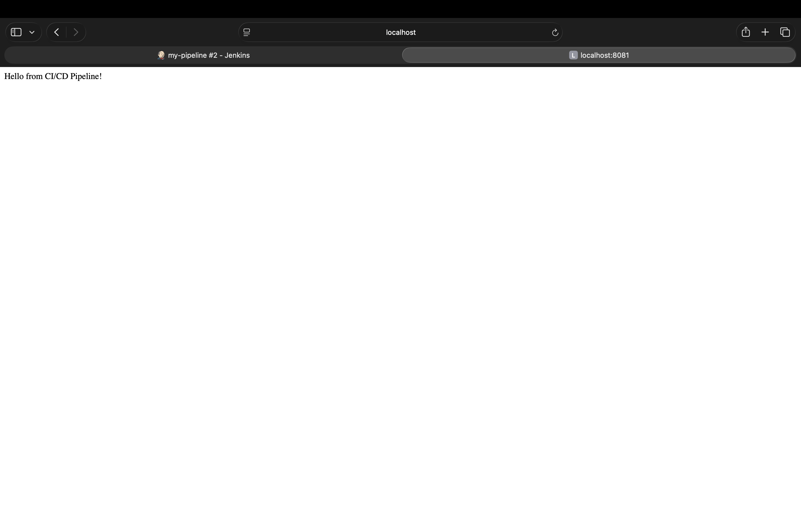

---

#  Workflow Diagram

```
Developer → GitHub → Webhook → Jenkins → Docker → Docker Hub
```

---

#  Observations

* Automation reduces manual work
* Jenkins simplifies pipeline creation
* Docker ensures consistency
* Webhook enables real-time triggering

---

# Result

Successfully implemented a CI/CD pipeline where:

* Code push triggers Jenkins automatically
* Docker image is built and pushed
* Full automation achieved

---


# Conclusion

This experiment demonstrates how modern DevOps tools can automate software development and deployment efficiently.

---
