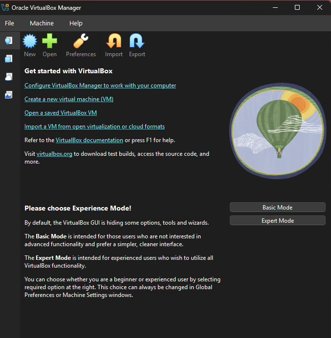
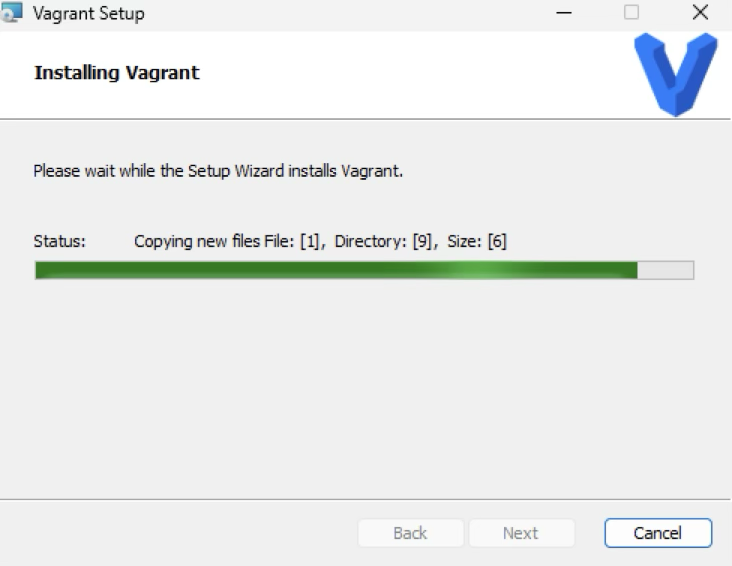
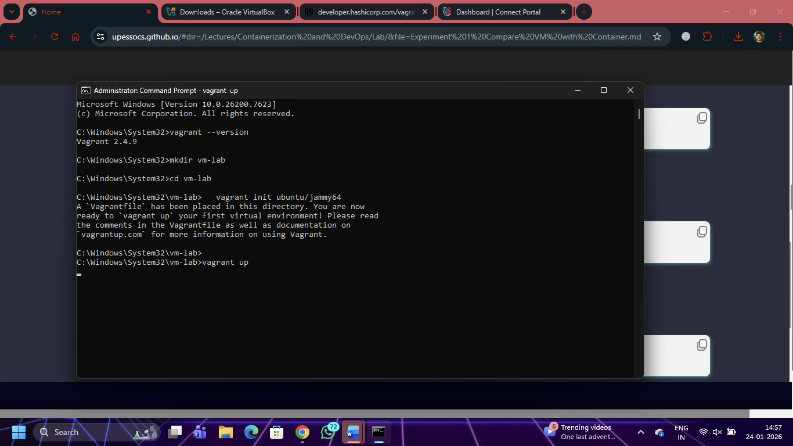
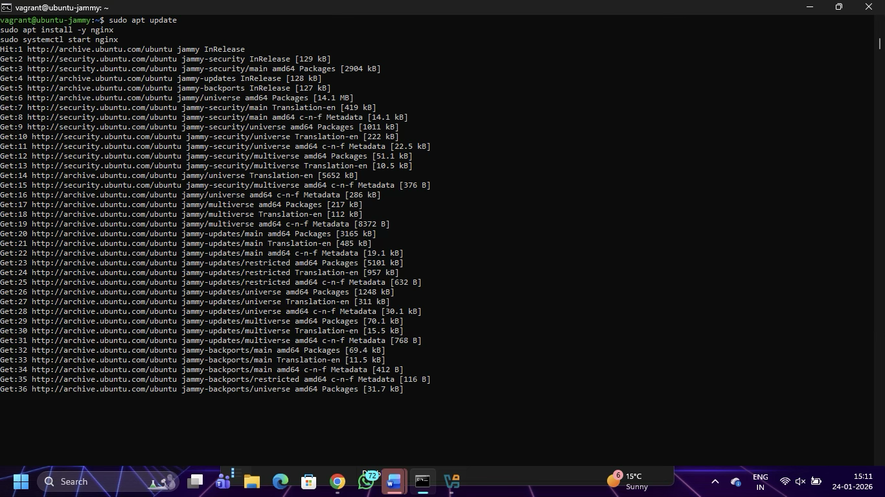
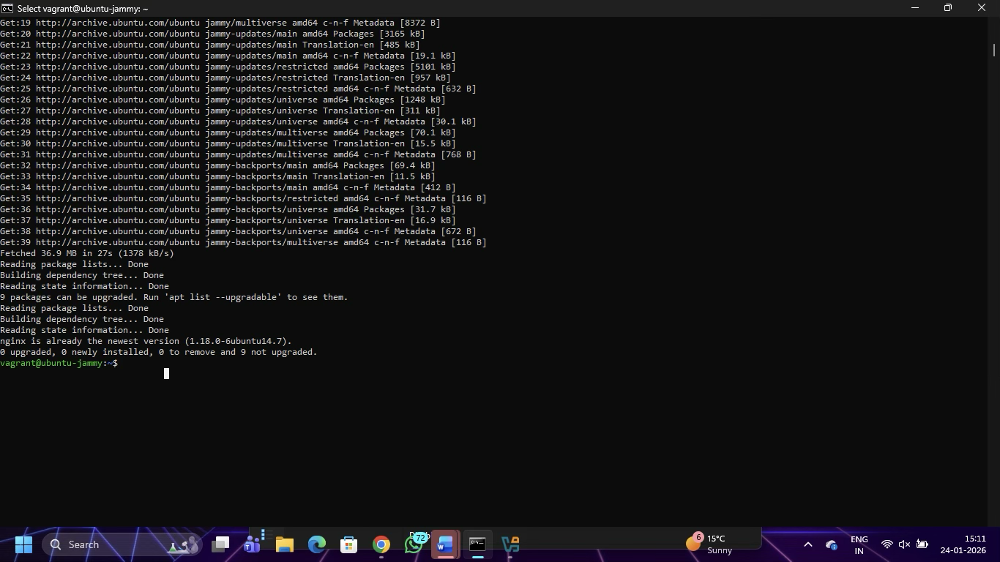
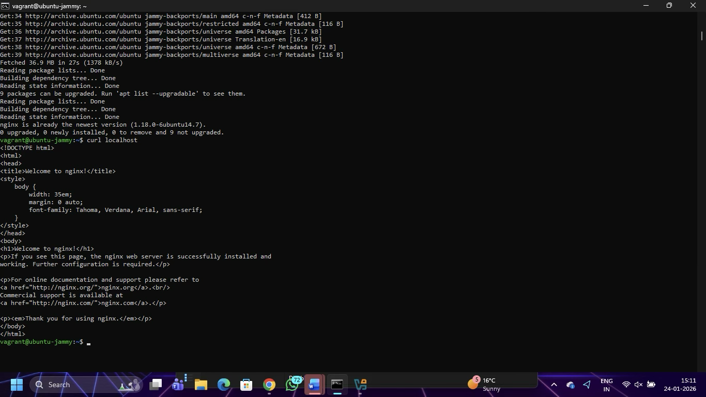
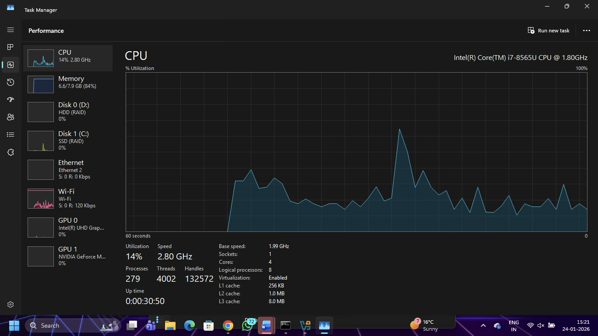
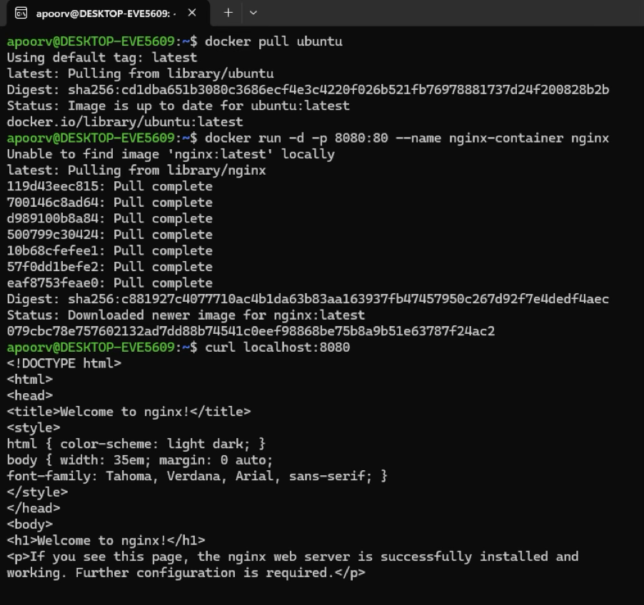

# Experiment 1

## Title
Compare Virtual Machine and Container

---

## Objective
To study Virtual Machines and Containers, deploy services using both approaches, analyze system resource usage, and conclude which virtualization technique is more efficient.

---

## Tools Used
- Oracle VirtualBox  
- Vagrant  
- Ubuntu (Jammy 22.04)  
- Nginx  
- Docker  
- Windows Task Manager  

---

## Theory

Virtual Machine (VM) and Container are two different approaches to virtualization.

A Virtual Machine provides hardware-level virtualization and runs a complete operating system. Each VM includes its own OS, libraries, and dependencies. Due to this, Virtual Machines consume more CPU, memory, and storage resources. VM startup time is also higher.

Containers provide operating system-level virtualization. Containers share the host operating system kernel and only package the application with its dependencies. This makes containers lightweight, faster, and more resource-efficient.

In this experiment, a Virtual Machine is created using VirtualBox and Vagrant, and Nginx is installed inside it. Later, the same service is deployed using Docker containers. Resource usage is compared to determine which approach performs better.

---

## Procedure

### Part A: Virtual Machine Setup

#### Step 1: Install VirtualBox
Oracle VirtualBox was installed to manage virtual machines.



---

#### Step 2: Install Vagrant
Vagrant was installed to automate VM creation.



---

#### Step 3: Verify Vagrant Installation

```bash
vagrant --version
```

#### Step 4: Initialize Ubuntu Virtual Machine

```bash
vagrant init ubuntu/jammy64
```



#### Step 5: Start the Virtual Machine
```bash
vagrant up
```


#### Step 6: Access Ubuntu VM
```bash
vagrant ssh
```


#### Step 7: Install Nginx inside VM
```bash
sudo apt update
sudo apt install nginx
sudo systemctl start nginx
```


#### Step 8: Verify Nginx in VM
```bash
curl localhost
```


#### Step 9: Observe Resource Usage (VM)

CPU and memory usage were monitored using Task Manager while VM was running.



### Part B: Container Setup (Docker)
#### Step 10: Pull Ubuntu and Nginx Images
```bash
docker pull ubuntu
docker pull nginx
```




#### Step 11: Run Nginx Container
```bash
docker run -d -p 8080:80 --name nginx-container nginx
```

#### Step 12: Verify Nginx in Container
```bash
curl localhost:8080
```


### Commands Used
```bash
vagrant init ubuntu/jammy64
vagrant up
vagrant ssh
sudo apt update
sudo apt install nginx
curl localhost
vagrant halt
vagrant destroy

docker pull ubuntu
docker pull nginx
docker run -d -p 8080:80 --name nginx-container nginx
docker images
```

### Observation

It was observed that the Virtual Machine consumed significantly higher CPU and memory resources because it runs a complete operating system. The Docker container started faster and consumed fewer resources while running the same Nginx service.


### Conclusion

Containers are more efficient than Virtual Machines. Containers are lightweight, start faster, and consume fewer system resources because they share the host operating system kernel. This experiment clearly demonstrates that container-based virtualization is better suited for modern application deployment compared to traditional Virtual Machines.
