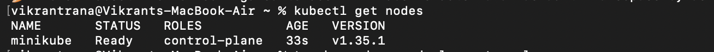
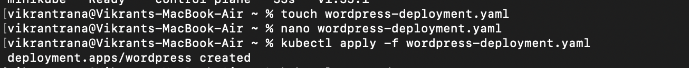
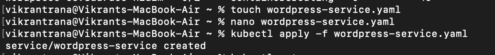
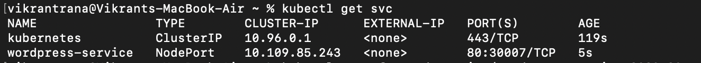
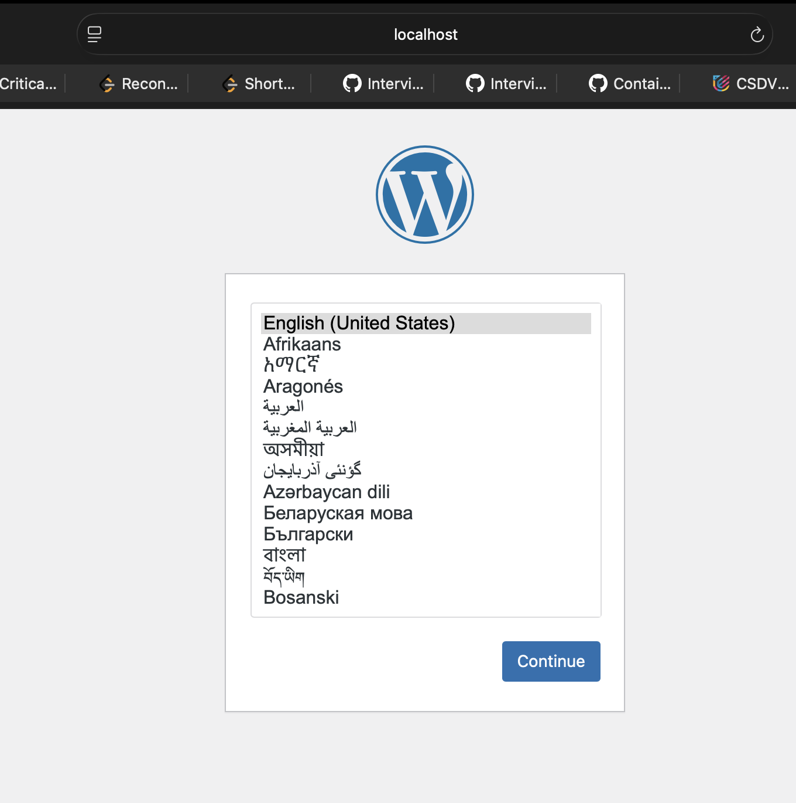
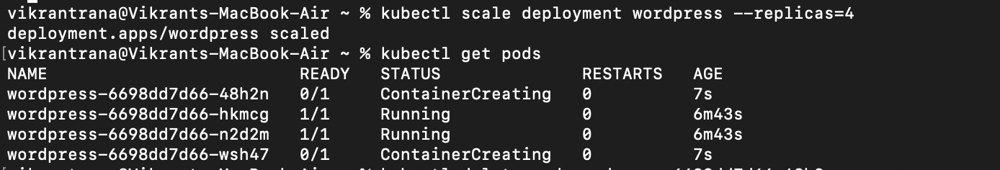
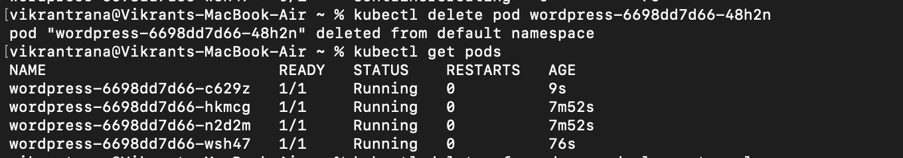
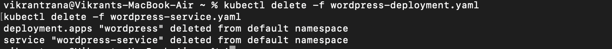

# Experiment 12: Study and Analyse Container Orchestration using Kubernetes

---

##  Objective

To understand Kubernetes concepts and perform deployment, scaling, and self-healing of applications using `kubectl`.

---

## Theory

### What is Kubernetes?

Kubernetes is an open-source container orchestration platform used to automate deployment, scaling, and management of containerized applications.

---

###  Why Kubernetes?

* Industry standard for orchestration
* Supports automatic scaling
* Provides self-healing
* Works across cloud platforms

---

###  Core Concepts

| Docker Concept | Kubernetes Equivalent | Description                 |
| -------------- | --------------------- | --------------------------- |
| Container      | Pod                   | Smallest unit in Kubernetes |
| Service        | Service               | Exposes application         |
| Compose        | Deployment            | Manages pods                |
| Scaling        | ReplicaSet            | Maintains desired pod count |

---

##  Tools Used

* kubectl
* Kubernetes cluster (k3d / Minikube)
* macOS Terminal

---

##  Implementation Steps

---

###  Step 1: Verify Cluster

```bash
kubectl get nodes
```

---

###  Step 2: Create Deployment File

```bash
nano wordpress-deployment.yaml
```

```yaml
apiVersion: apps/v1
kind: Deployment
metadata:
  name: wordpress
spec:
  replicas: 2
  selector:
    matchLabels:
      app: wordpress
  template:
    metadata:
      labels:
        app: wordpress
    spec:
      containers:
      - name: wordpress
        image: wordpress:latest
        ports:
        - containerPort: 80
```

---

### Step 3: Apply Deployment

```bash
kubectl apply -f wordpress-deployment.yaml
```

---

###  Step 4: Verify Pods

```bash
kubectl get pods
```

---

### Step 5: Create Service File

```bash
nano wordpress-service.yaml
```

```yaml
apiVersion: v1
kind: Service
metadata:
  name: wordpress-service
spec:
  type: NodePort
  selector:
    app: wordpress
  ports:
    - port: 80
      targetPort: 80
      nodePort: 30007
```

---

###  Step 6: Apply Service

```bash
kubectl apply -f wordpress-service.yaml
```

---

###  Step 7: Verify Service

```bash
kubectl get svc
```

---

###  Step 8: Access Application

```bash
kubectl port-forward service/wordpress-service 8082:80
```

Open:

```
http://localhost:8082
```


---

###  Step 9: Scale Deployment

```bash
kubectl scale deployment wordpress --replicas=4
```

---

###  Step 10: Verify Scaling

```bash
kubectl get pods
```

---

###  Step 11: Test Self-Healing

```bash
kubectl get pods
kubectl delete pod <pod-name>
kubectl get pods
```

---

###  Step 12: Cleanup

```bash
kubectl delete -f wordpress-deployment.yaml
kubectl delete -f wordpress-service.yaml
```

---

##  Result

* Deployment created successfully
* Service exposed the application
* Scaling increased pods from 2 to 4
* Kubernetes automatically recreated deleted pods

---

##  Conclusion

Kubernetes simplifies container orchestration by providing automated deployment, scaling, and self-healing capabilities, making it a powerful tool for modern applications.

---

##  Key Takeaways

* Deployment manages pods
* Service exposes applications
* Scaling improves performance
* Self-healing ensures reliability

---


##  Key Learning

> Kubernetes ensures desired state by automatically managing containers, scaling applications, and recovering from failures.

---