#  Experiment 4: Docker Essentials  
## Dockerfile | .dockerignore | Tagging | Publishing

---

##  Objective

To understand Docker containerization by:
- Creating a Dockerfile
- Using .dockerignore
- Building Docker images
- Running containers
- Performing multi-stage builds
- Tagging and publishing images to Docker Hub

---

#  Part 1: Create Flask Application

## Step 1: Create Project Directory

```bash
mkdir my-flask-app
cd my-flask-app
```
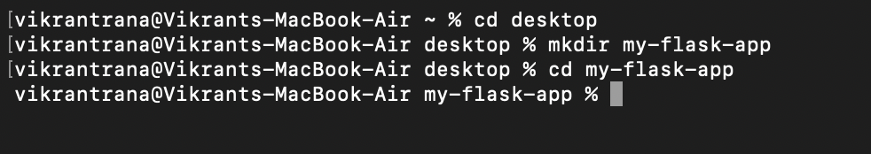
---

## Step 2: Create `app.py`

```python
from flask import Flask

app = Flask(__name__)

@app.route('/')
def hello():
    return "Hello from Docker!"

@app.route('/health')
def health():
    return "OK"

if __name__ == '__main__':
    app.run(host='0.0.0.0', port=5000)
```
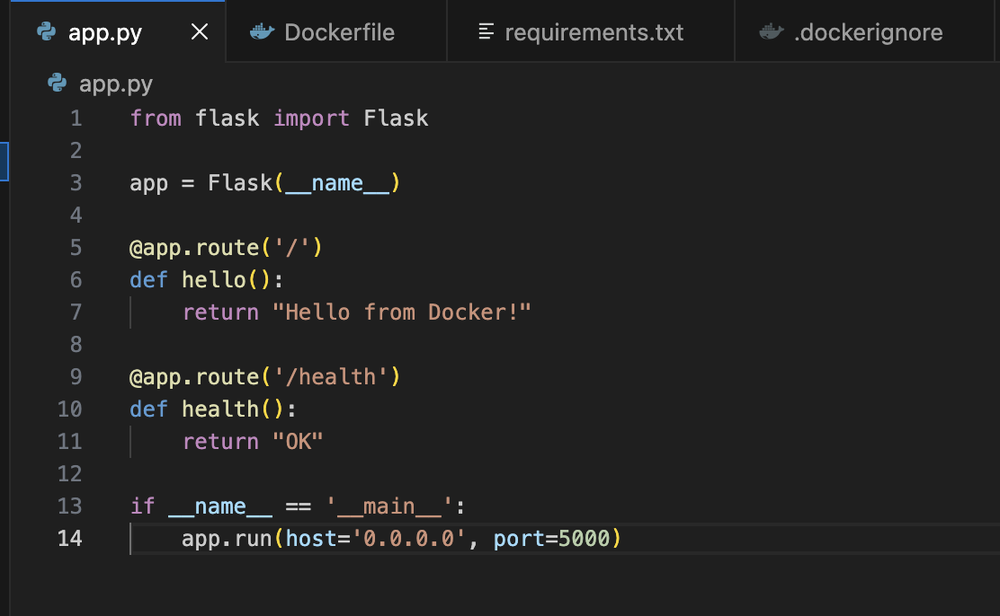
---

## Step 3: Create `requirements.txt`

```text
Flask==2.3.3
```
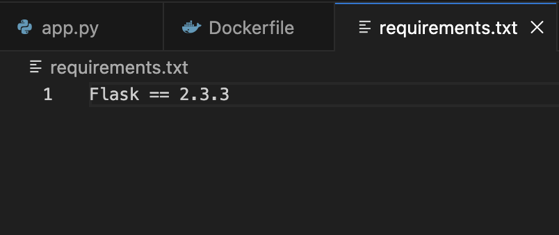
---

#  Part 2: Create Dockerfile

Create a file named `Dockerfile`:

```dockerfile
FROM python:3.9-slim

WORKDIR /app

COPY requirements.txt .

RUN pip install --no-cache-dir -r requirements.txt

COPY app.py .

EXPOSE 5001

CMD ["python", "app.py"]
```
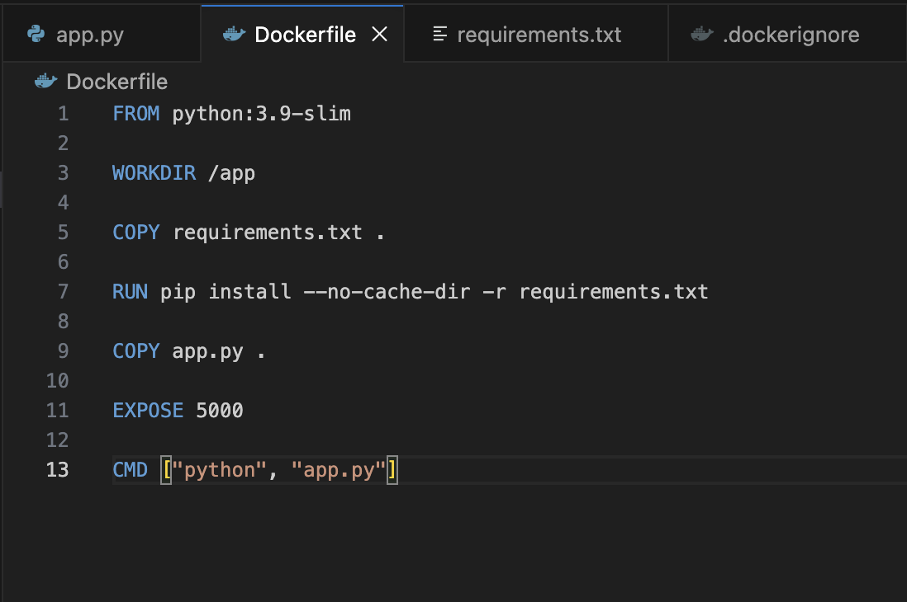
---

# Part 3: Create `.dockerignore`

```text
__pycache__/
*.pyc
*.pyo
*.pyd

.env
.venv
env/
venv/

.vscode/
.idea/

.git/
.gitignore

.DS_Store
Thumbs.db

*.log
logs/

tests/
test_*.py
```

---
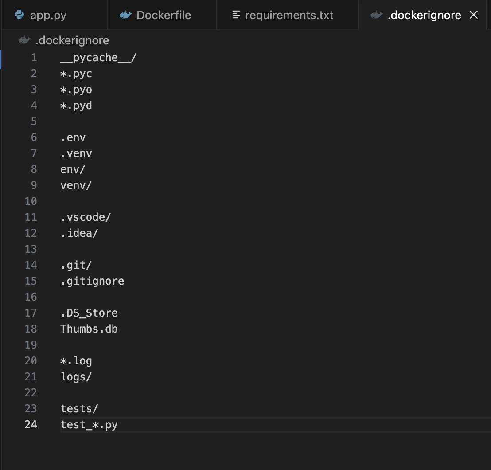

# Part 4: Build Docker Image

```bash
docker build -t my-flask-app .
```

Check images:

```bash
docker images
```

---
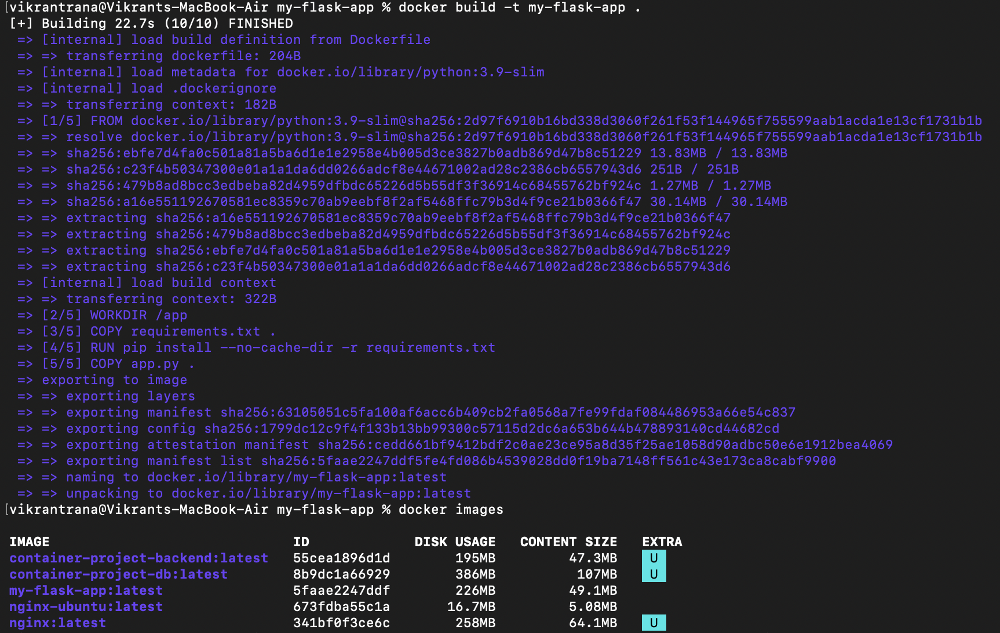

# ▶ Part 5: Run Container

```bash
docker run -d -p 5001:5000 --name flask-container my-flask-app
```
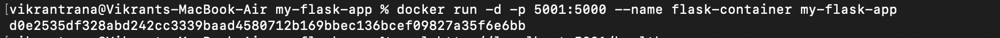

Check running containers:

```bash
docker ps
```


Test in browser:

```
http://localhost:5001
```
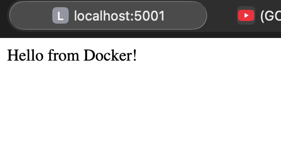

Test health endpoint:

```bash
curl http://localhost:5001/health
```


---

#  Manage Container

Stop container:

```bash
docker stop flask-container
```

Start container:

```bash
docker start flask-container
```

Remove container:

```bash
docker rm -f flask-container
```
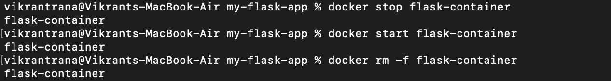
---

#  Part 6: Multi-Stage Build

Create `Dockerfile.multistage`:

```dockerfile
# Stage 1 - Builder
FROM python:3.9-slim AS builder

WORKDIR /app

COPY requirements.txt .

RUN python -m venv /opt/venv
ENV PATH="/opt/venv/bin:$PATH"

RUN pip install --no-cache-dir -r requirements.txt

# Stage 2 - Final Image
FROM python:3.9-slim

WORKDIR /app

COPY --from=builder /opt/venv /opt/venv
ENV PATH="/opt/venv/bin:$PATH"

COPY app.py .

RUN useradd -m -u 1000 appuser
USER appuser

EXPOSE 5001

CMD ["python", "app.py"]
```
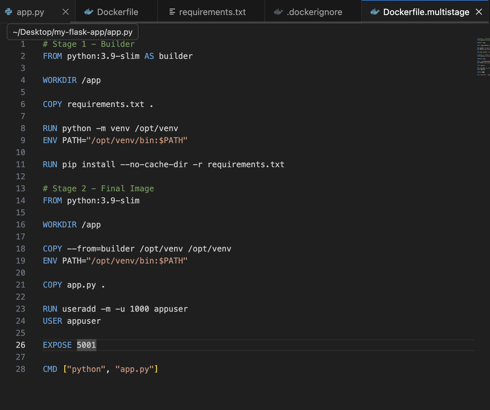

Build multi-stage image:

```bash
docker build -f Dockerfile.multistage -t flask-multistage .
```

Compare sizes:

```bash
docker images
```

---
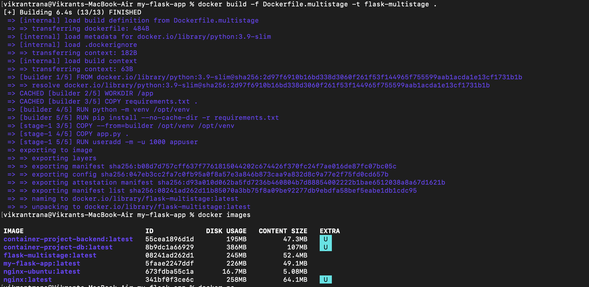

