# Experiment 6: Comparison of Docker Run and Docker Compose

---

## Objective

To understand and compare:

- Docker Run (Imperative approach)
- Docker Compose (Declarative approach)
- Configuration mapping between Docker Run and Compose
- Single-container and multi-container deployment
- Resource limit configuration
- Using Dockerfile with Compose
- Multi-stage builds using Compose

---

# PART A – THEORY

---

## 1. Docker Run (Imperative Approach)

The `docker run` command is used to create and start containers from an image.

It requires explicit configuration using command-line flags.

### Common Flags Used

- `-p` → Port mapping  
- `-v` → Volume mounting  
- `-e` → Environment variables  
- `--network` → Network configuration  
- `--restart` → Restart policy  
- `--memory` → Memory limit  
- `--cpus` → CPU limit  
- `--name` → Container name  

### Example

```bash
docker run -d \
  --name my-nginx \
  -p 8080:80 \
  -v ./html:/usr/share/nginx/html \
  -e NGINX_HOST=localhost \
  --restart unless-stopped \
  nginx:alpine
```

This approach is imperative because the user specifies step-by-step instructions.

---

## 2. Docker Compose (Declarative Approach)

Docker Compose uses a YAML configuration file (`docker-compose.yml`) to define services.

Instead of multiple `docker run` commands, a single command is used:

```bash
docker compose up -d
```

This approach is declarative because the desired state of the application is defined in a configuration file.

### Equivalent Compose Configuration

```yaml
version: '3.8'

services:
  nginx:
    image: nginx:alpine
    container_name: my-nginx
    ports:
      - "8080:80"
    volumes:
      - ./html:/usr/share/nginx/html
    environment:
      NGINX_HOST: localhost
    restart: unless-stopped
```

---

## 3. Mapping: Docker Run vs Docker Compose

| Docker Run Flag | Docker Compose Equivalent |
|-----------------|---------------------------|
| `-p` | `ports:` |
| `-v` | `volumes:` |
| `-e` | `environment:` |
| `--name` | `container_name:` |
| `--network` | `networks:` |
| `--restart` | `restart:` |
| `--memory` | `deploy.resources.limits.memory` |
| `--cpus` | `deploy.resources.limits.cpus` |
| `-d` | `docker compose up -d` |

---

## 4. Advantages of Docker Compose

- Simplifies multi-container applications
- Provides reproducible configuration
- Supports version control
- Manages complete lifecycle
- Supports service scaling

Example:

```bash
docker compose up --scale web=3
```

---

# PART B – PRACTICAL TASKS

---

## Task 1: Single Container Comparison

### Using Docker Run

```bash
docker run -d \
  --name lab-nginx \
  -p 8081:80 \
  -v $(pwd)/html:/usr/share/nginx/html \
  nginx:alpine
```

Verify:

```bash
docker ps
```

Access:

http://localhost:8081

Stop and remove:

```bash
docker stop lab-nginx
docker rm lab-nginx
```
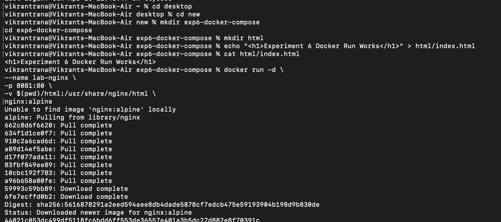
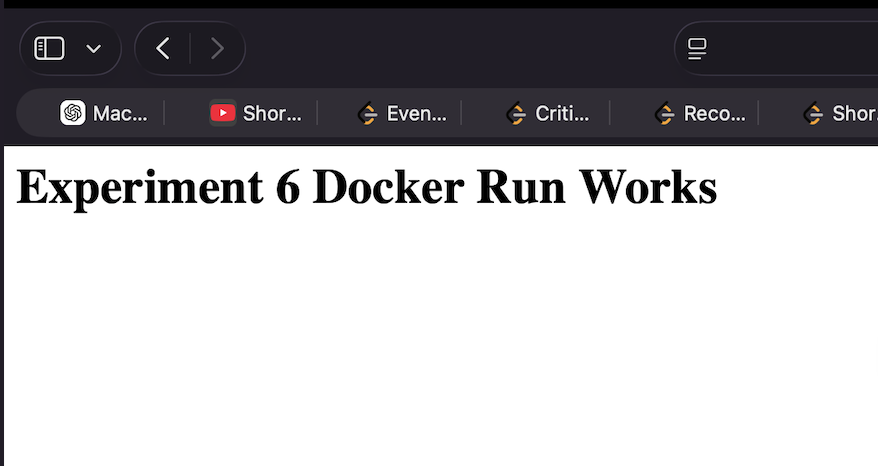
---

### Using Docker Compose

```yaml
version: '3.8'

services:
  nginx:
    image: nginx:alpine
    container_name: lab-nginx
    ports:
      - "8081:80"
    volumes:
      - ./html:/usr/share/nginx/html
```
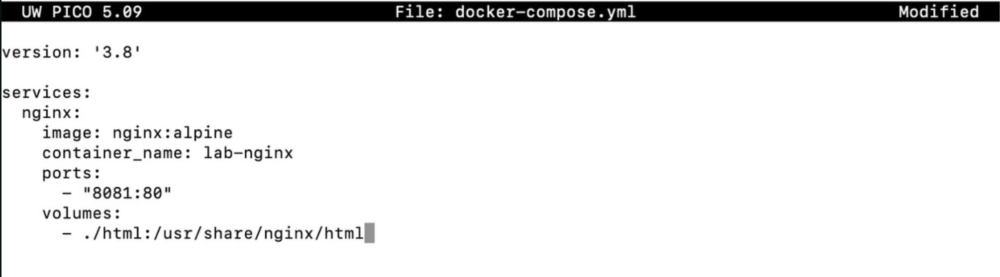

Run:

```bash
docker compose up -d
```

Verify:

```bash
docker compose ps
```

Stop:

```bash
docker compose down
```

---

## Task 2: Multi-Container Application (WordPress + MySQL)

### A. Using Docker Run

Create network:

```bash
docker network create wp-net
```
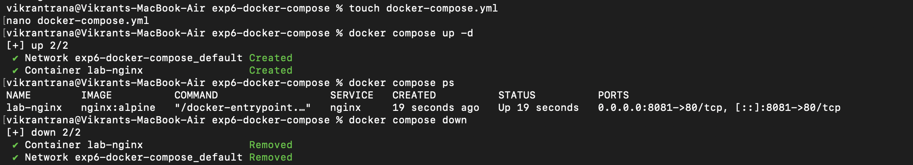
Run MySQL:

```bash
docker run -d \
  --platform linux/amd64 \
  --name mysql \
  --network wp-net \
  -e MYSQL_ROOT_PASSWORD=secret \
  -e MYSQL_DATABASE=wordpress \
  mysql:5.7
```

Run WordPress:

```bash
docker run -d \
  --name wordpress \
  --network wp-net \
  -p 8082:80 \
  -e WORDPRESS_DB_HOST=mysql \
  -e WORDPRESS_DB_USER=root \
  -e WORDPRESS_DB_PASSWORD=secret \
  -e WORDPRESS_DB_NAME=wordpress \
  wordpress:latest
```
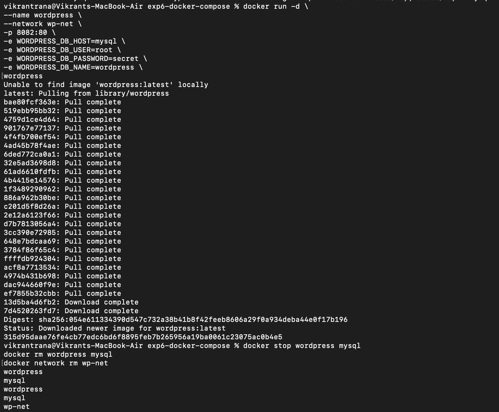

Access:

http://localhost:8082

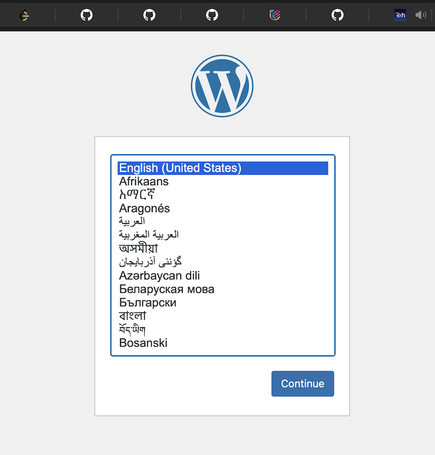

---

### B. Using Docker Compose

```yaml
version: '3.8'

services:
  mysql:
    image: mysql:5.7
    environment:
      MYSQL_ROOT_PASSWORD: secret
      MYSQL_DATABASE: wordpress
    volumes:
      - mysql_data:/var/lib/mysql

  wordpress:
    image: wordpress:latest
    ports:
      - "8082:80"
    environment:
      WORDPRESS_DB_HOST: mysql
      WORDPRESS_DB_PASSWORD: secret
    depends_on:
      - mysql

volumes:
  mysql_data:
```
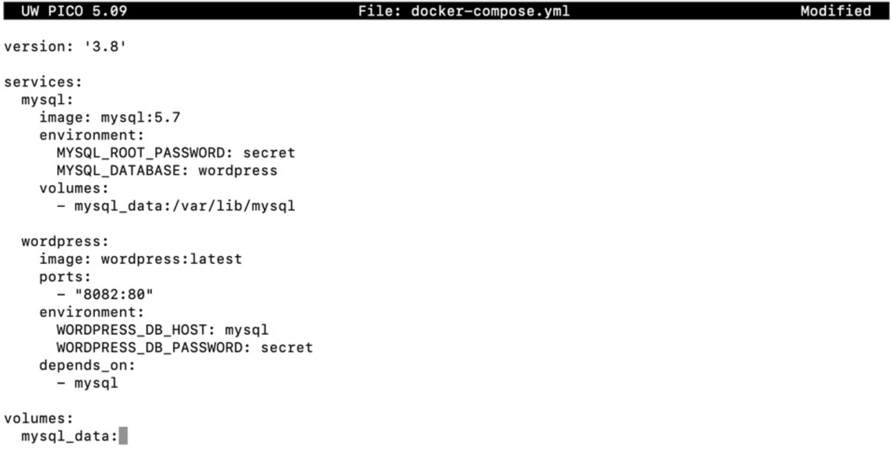

Run:

```bash
docker compose up -d
```

Stop:

```bash
docker compose down -v
```
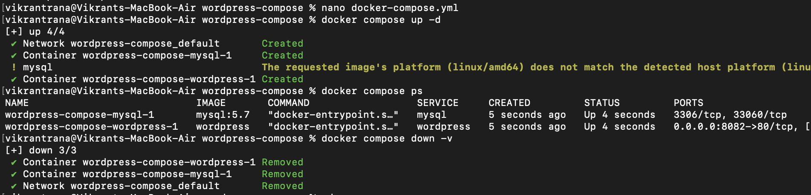
---

# PART C – CONVERSION & RESOURCE TASKS

---

## Task 3: Convert Docker Run to Docker Compose

Given:

```bash
docker run -d \
  --name webapp \
  -p 5000:5000 \
  -e APP_ENV=production \
  -e DEBUG=false \
  --restart unless-stopped \
  node:18-alpine
```
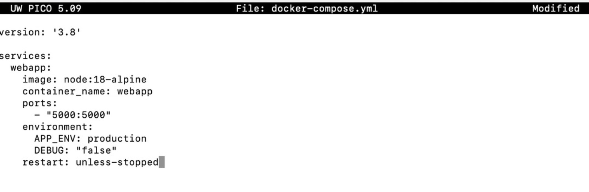

Compose equivalent:

```yaml
version: '3.8'

services:
  webapp:
    image: node:18-alpine
    container_name: webapp
    ports:
      - "5000:5000"
    environment:
      APP_ENV: production
      DEBUG: "false"
    restart: unless-stopped
```

---

## Task 4: Resource Limits Conversion

Given:

```bash
docker run -d \
  --name limited-app \
  -p 9000:9000 \
  --memory="256m" \
  --cpus="0.5" \
  --restart always \
  nginx:alpine
```

Compose equivalent:

```yaml
version: '3.8'

services:
  limited-app:
    image: nginx:alpine
    container_name: limited-app
    ports:
      - "9000:9000"
    restart: always
    deploy:
      resources:
        limits:
          memory: 256m
          cpus: '0.5'
```


Note:  
The `deploy` section works only in Docker Swarm mode.

---

# PART D – USING DOCKERFILE WITH COMPOSE

---

## Task 5: Replace Standard Image with Dockerfile

### app.js

```javascript
const http = require('http');

http.createServer((req, res) => {
  res.end("Docker Compose Build Lab");
}).listen(3000);
```
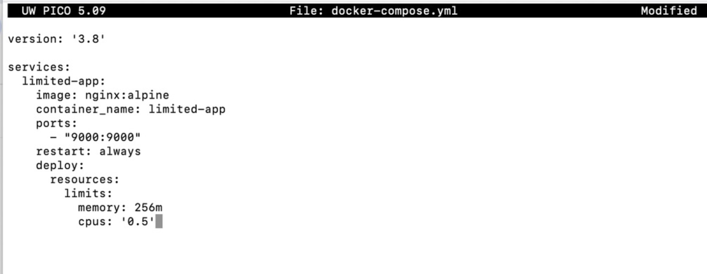

### Dockerfile

```dockerfile
FROM node:18-alpine

WORKDIR /app
COPY app.js .
EXPOSE 3000

CMD ["node", "app.js"]
```
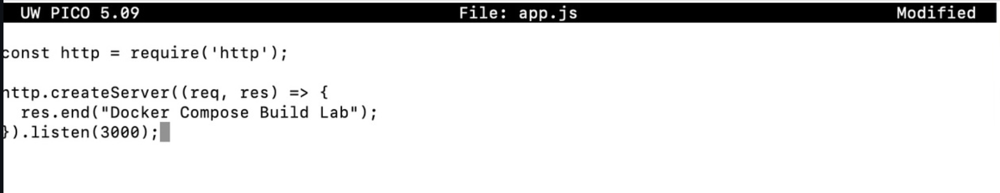

### docker-compose.yml

```yaml
version: '3.8'

services:
  nodeapp:
    build:
      context: .
      dockerfile: Dockerfile
    container_name: custom-node-app
    ports:
      - "3000:3000"
```
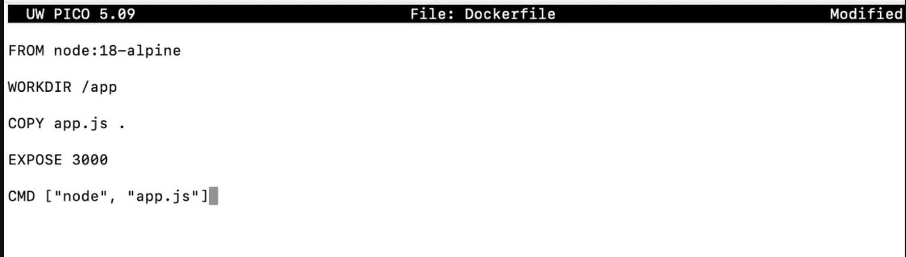

Run:

```bash
docker compose up --build -d
```
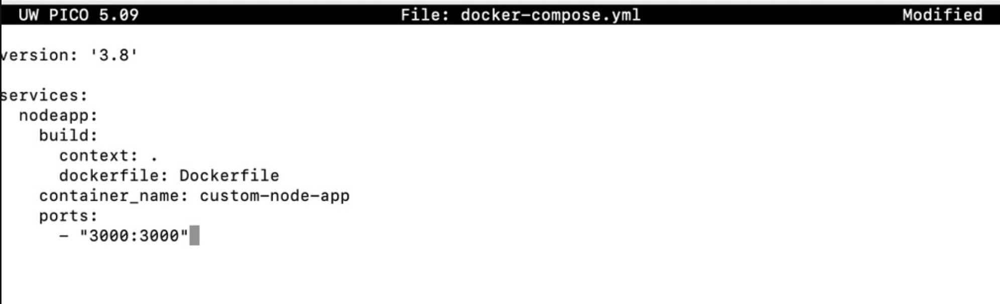
---

## Difference Between image and build

| image | build |
|-------|-------|
| Uses prebuilt image | Builds locally |
| Faster startup | Customizable |
| No Dockerfile required | Dockerfile required |

---

## Task 6: Multi-Stage Dockerfile

```dockerfile
FROM node:18-alpine AS builder
WORKDIR /app
COPY app.js .

FROM node:18-alpine
WORKDIR /app
COPY --from=builder /app/app.js .
EXPOSE 3000
CMD ["node", "app.js"]
```
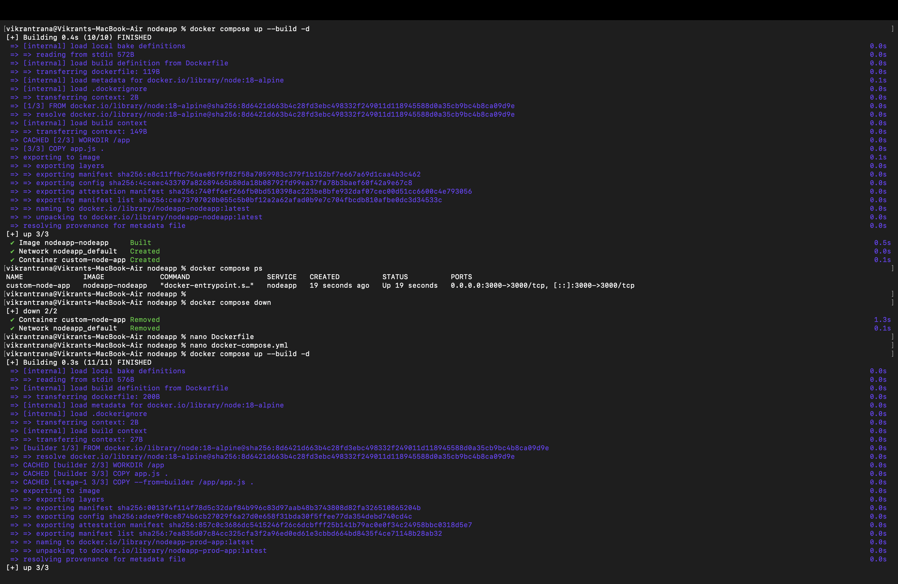

Compose configuration:

```yaml
version: '3.8'

services:
  prod-app:
    build:
      context: .
      dockerfile: Dockerfile
    ports:
      - "3001:3000"
    environment:
      NODE_ENV: production
```
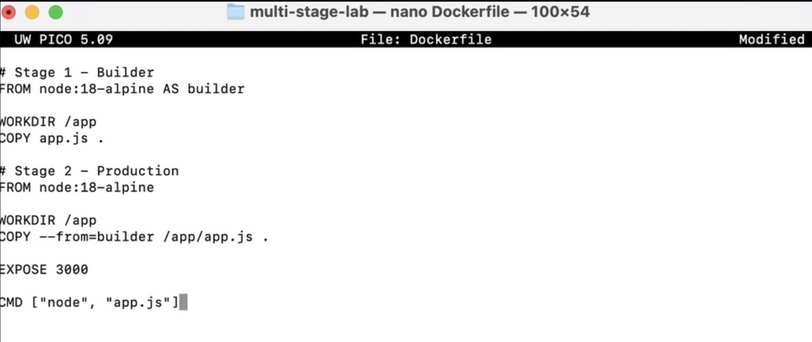
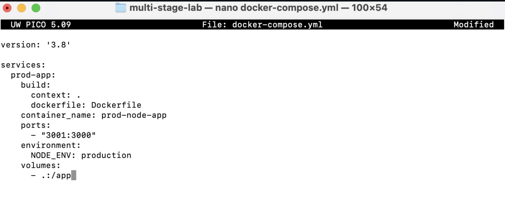

---


# Conclusion

Docker Run follows an imperative approach where configuration is provided manually through flags.

Docker Compose follows a declarative approach where the entire application configuration is defined in a YAML file.

Docker Compose is preferred for multi-container and scalable applications, while Docker Run is suitable for simple and quick container execution.