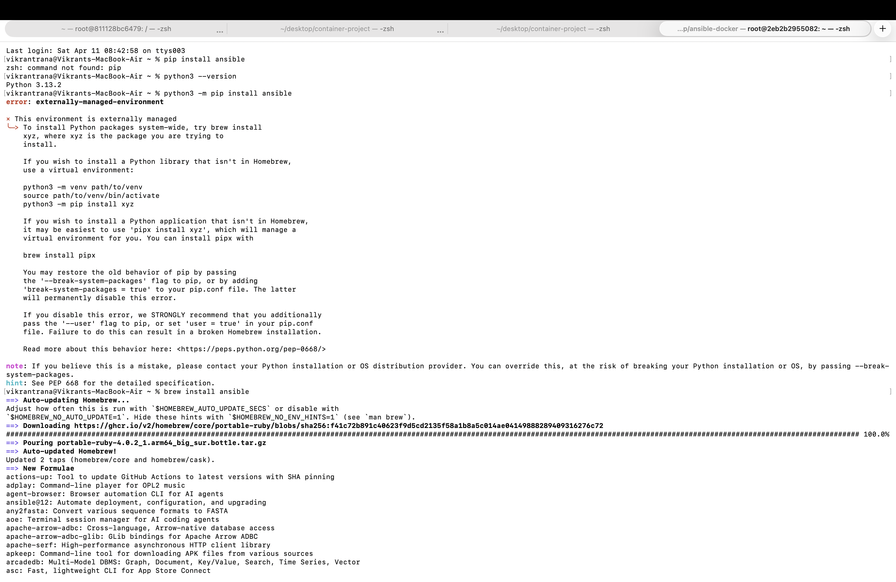
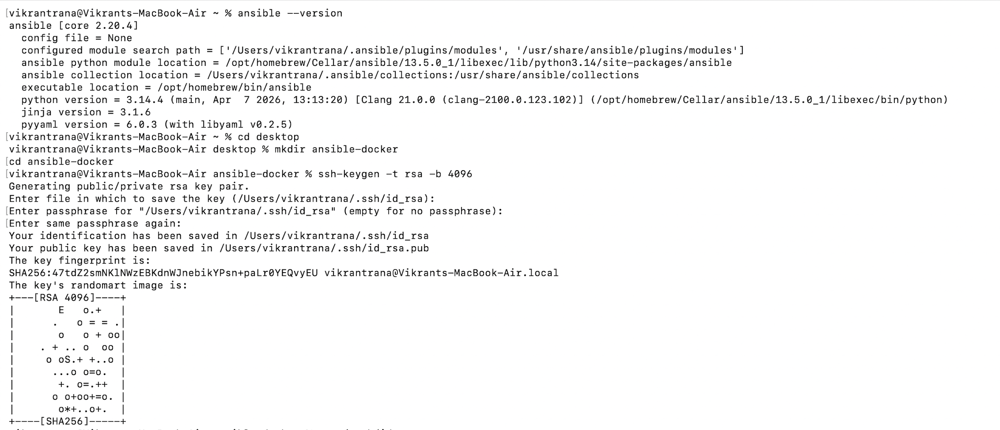
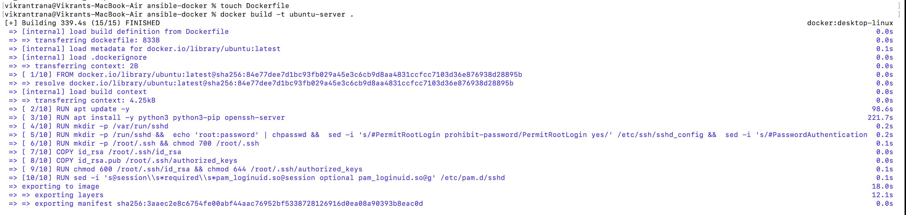
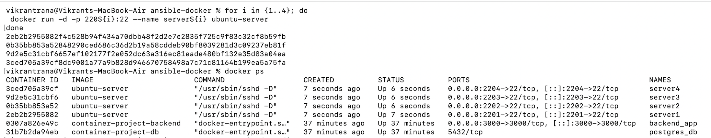
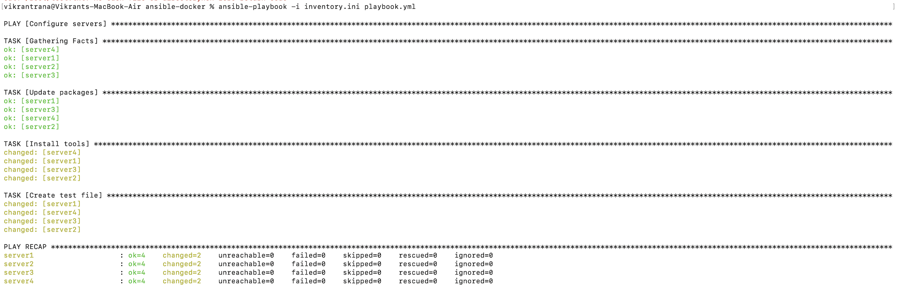

# Experiment 9: Ansible Automation with Docker

---

## Objective

To understand and implement Ansible for configuration management by automating tasks on multiple Docker-based servers using SSH authentication.

---

## Theory

### What is Ansible?

Ansible is an open-source automation tool used for:

* Configuration Management
* Application Deployment
* Orchestration

It uses an **agentless architecture**, meaning no software is required on managed nodes. Communication is done using **SSH**.

---

###  Key Features

* Agentless (uses SSH)
* Idempotent (safe repeated execution)
* YAML-based playbooks
* Push-based architecture
* Simple and human-readable

---

###  Key Components

| Component     | Description                             |
| ------------- | --------------------------------------- |
| Control Node  | Machine where Ansible is installed      |
| Managed Nodes | Target systems (Docker containers)      |
| Inventory     | List of servers (`inventory.ini`)       |
| Playbooks     | YAML files defining tasks               |
| Tasks         | Individual actions                      |
| Modules       | Built-in functions (copy, command, apt) |

---

##  Tools Used

* Ansible
* Docker
* SSH
* macOS Terminal

---

##  Implementation Steps

---

###  Step 1: Create Project Directory

```bash
mkdir ansible-docker-lab
cd ansible-docker-lab
```

---

###  Step 2: Generate SSH Keys

```bash
ssh-keygen -t rsa -b 4096
```

---

###  Step 3: Copy SSH Keys

```bash
cp ~/.ssh/id_rsa .
cp ~/.ssh/id_rsa.pub .
```

---

###  Step 4: Create Dockerfile

```dockerfile
FROM ubuntu

RUN apt update -y
RUN apt install -y python3 python3-pip openssh-server
RUN mkdir -p /var/run/sshd

RUN mkdir -p /run/sshd && \
    echo 'root:password' | chpasswd && \
    sed -i 's/#PermitRootLogin prohibit-password/PermitRootLogin yes/' /etc/ssh/sshd_config && \
    sed -i 's/#PasswordAuthentication yes/PasswordAuthentication no/' /etc/ssh/sshd_config && \
    sed -i 's/#PubkeyAuthentication yes/PubkeyAuthentication yes/' /etc/ssh/sshd_config

RUN mkdir -p /root/.ssh && chmod 700 /root/.ssh

COPY id_rsa /root/.ssh/id_rsa
COPY id_rsa.pub /root/.ssh/authorized_keys

RUN chmod 600 /root/.ssh/id_rsa && \
    chmod 644 /root/.ssh/authorized_keys

EXPOSE 22

CMD ["/usr/sbin/sshd", "-D"]
```

---

###  Step 5: Build Docker Image

```bash
docker build -t ubuntu-server .
```

---

###  Step 6: Run Multiple Containers

```bash
for i in {1..4}; do
  docker run -d -p 220${i}:22 --name server${i} ubuntu-server
done
```

---

###  Step 7: Create Inventory File (inventory.ini)

```ini
[servers]
localhost ansible_port=2201
localhost ansible_port=2202
localhost ansible_port=2203
localhost ansible_port=2204

[servers:vars]
ansible_user=root
ansible_ssh_private_key_file=~/.ssh/id_rsa
ansible_python_interpreter=/usr/bin/python3
ansible_ssh_common_args='-o StrictHostKeyChecking=no'
```

---

###  Step 8: Test Connectivity

```bash
ansible all -i inventory.ini -m ping
```

---

###  Step 9: Create Playbook (playbook.yml)

```yaml
---
- name: Quick Ansible Test
  hosts: all
  become: yes

  tasks:
    - name: Create test file
      copy:
        dest: /root/ansible_test.txt
        content: |
          Configured successfully using Ansible
          Host: {{ inventory_hostname }}

    - name: Get system info
      command: uname -a
      register: sysinfo

    - name: Display output
      debug:
        msg: "{{ sysinfo.stdout }}"
```

---

###  Step 10: Run Playbook

```bash
ansible-playbook -i inventory.ini playbook.yml
```

---

###  Step 11: Verify Output

```bash
ansible all -i inventory.ini -m command -a "cat /root/ansible_test.txt"
```

---

###  Step 12: Cleanup

```bash
for i in {1..4}; do docker rm -f server${i}; done
```

---

## Result

* Successfully created Docker-based servers
* Established SSH connection using key-based authentication
* Automated configuration using Ansible playbook
* Verified execution across multiple nodes

---

##  Conclusion

Ansible simplifies server management by automating repetitive tasks. It ensures consistency, reduces manual effort, and enables scalable infrastructure management using a simple YAML-based approach.

---