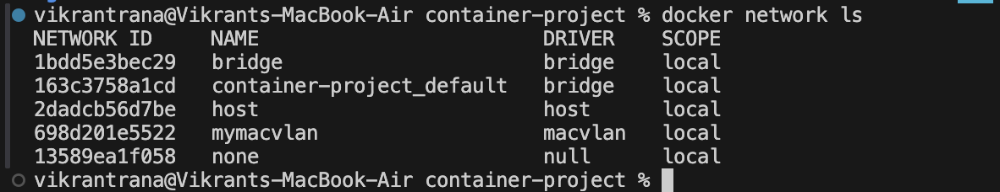
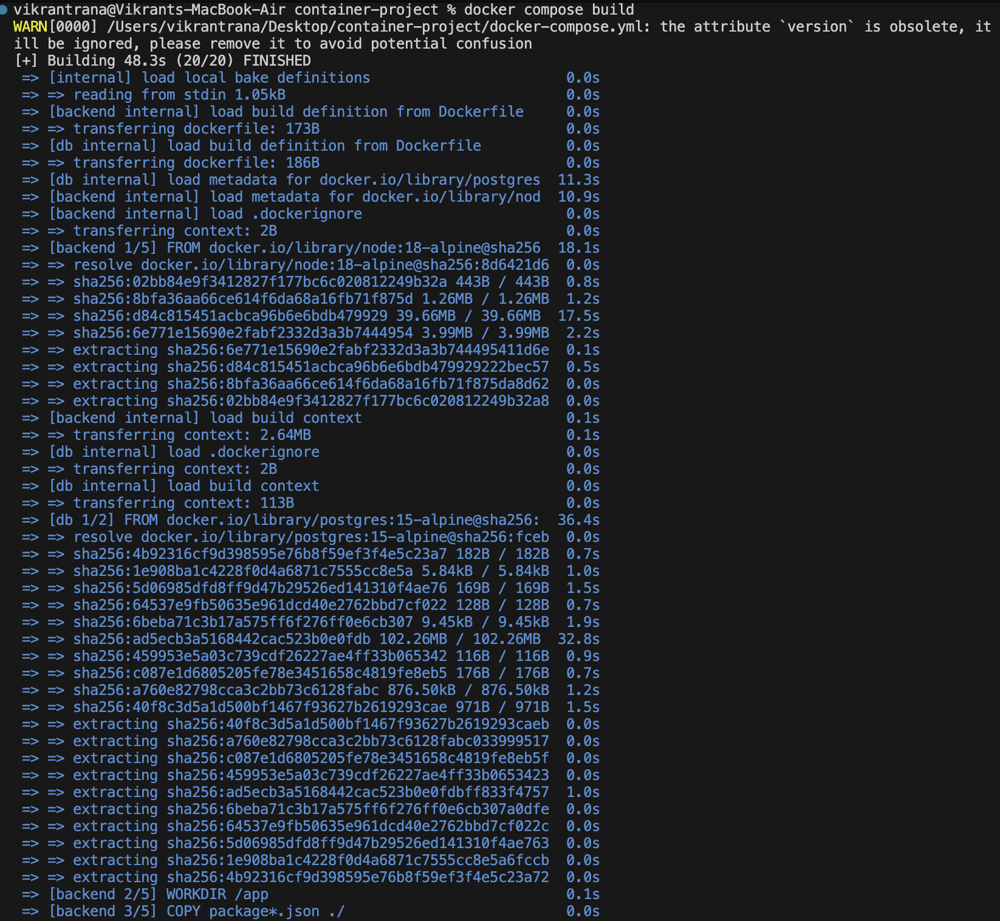
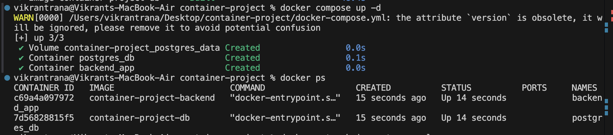
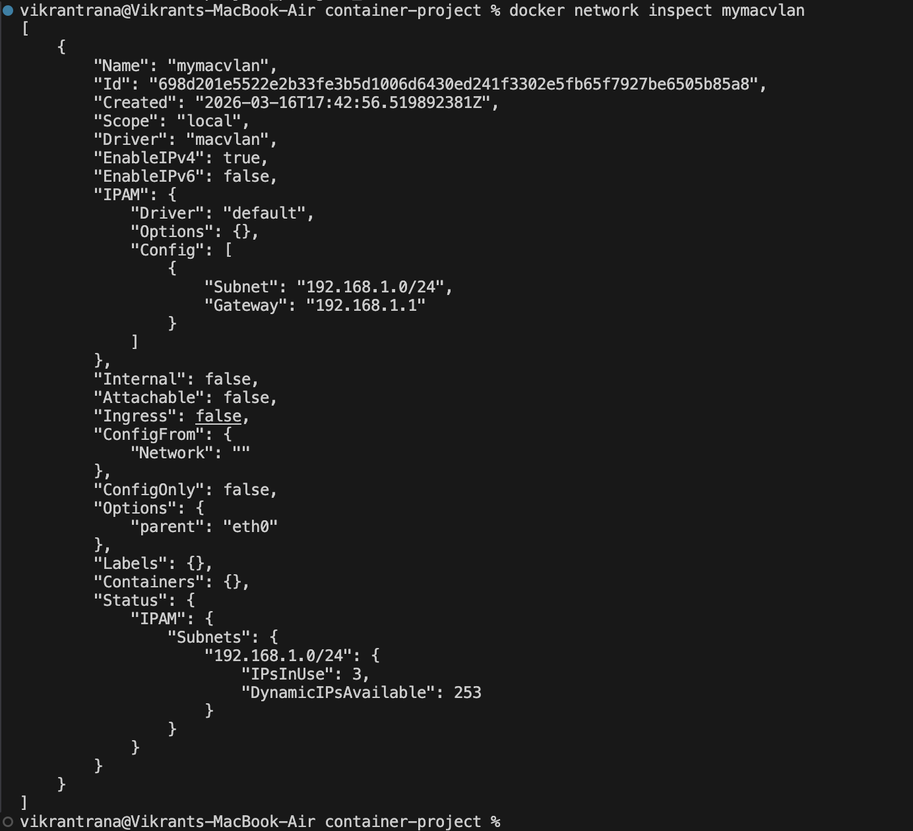
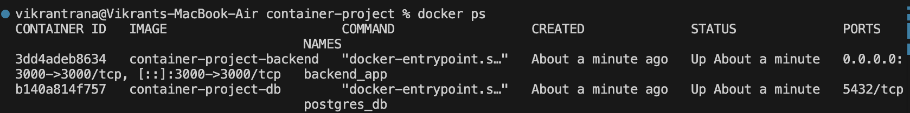
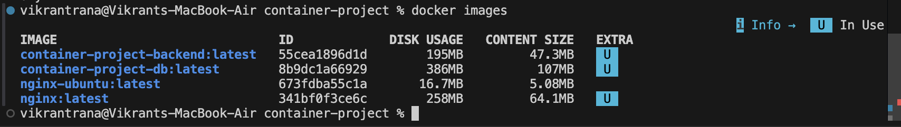
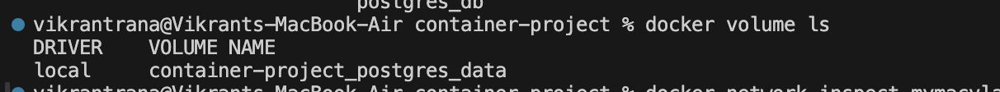
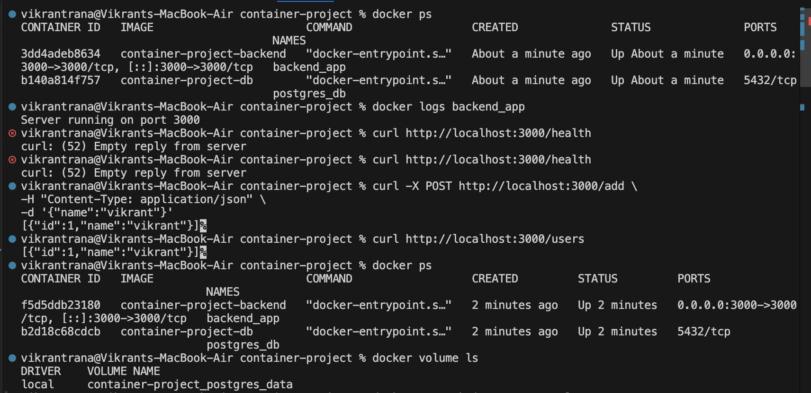

# Containerized Web Application with PostgreSQL using Docker Compose and Macvlan
University of Petroleum and Energy Studies

Course: Containerization and DevOps
Assignment: Containerized Web Application with PostgreSQL using Docker Compose and Macvlan

## Project Overview

This project demonstrates how to design, containerize, and deploy a web application using Docker.

The application consists of:

Backend API: Node.js + Express

Database: PostgreSQL

Orchestration: Docker Compose

Networking: Docker Macvlan

Storage: Docker Named Volume

Containers communicate using a Macvlan network, allowing each container to have its own static IP address within the LAN.

Architecture
Network Design Diagram
```bash 
Client (Browser / Postman)
        │
        ▼
localhost:3000 (Port Mapping)
        │
        ▼
Docker Host (macOS + Docker Desktop)
        │
        ▼
Docker Bridge Network
(172.18.0.0/16)
        │
        ├───────────────┬───────────────┐
        ▼               ▼
Backend Container      PostgreSQL Container
(Node.js + Express)    (PostgreSQL DB)
IP: 172.18.0.3         IP: 172.18.0.2
Port: 3000             Port: 5432
        │
        ▼
Docker Volume (postgres_data)
Persistent Storage
``` 
## Repository Structure:
```bash
container-project/
│
├── backend/
│   ├── Dockerfile          
│   ├── package.json        
│   ├── package-lock.json   
│   ├── server.js           
│   └── node_modules/      
│
├── database/
│   ├── Dockerfile          
│   └── init.sql            
│
├── docker-compose.yml      
├── .dockerignore           
└── README.md               
```


### backend/server.js
```bash
const express = require("express");
const { Pool } = require("pg");

const app = express();
app.use(express.json());

const pool = new Pool({
  host: process.env.DB_HOST,
  user: process.env.POSTGRES_USER,
  password: process.env.POSTGRES_PASSWORD,
  database: process.env.POSTGRES_DB,
  port: 5432
});

app.get("/health", (req, res) => {
  res.send("API running");
});

app.post("/add", async (req, res) => {
  const { name } = req.body;
  const result = await pool.query(
    "INSERT INTO users(name) VALUES($1) RETURNING *",
    [name]
  );
  res.json(result.rows);
});

app.get("/users", async (req, res) => {
  const result = await pool.query("SELECT * FROM users");
  res.json(result.rows);
});

app.listen(3000, "0.0.0.0",() => {
  console.log("Server running on port 3000");
});
```
### backend/package.json
```bash
{
  "name": "backend",
  "version": "1.0.0",
  "main": "index.js",
  "scripts": {
    "test": "echo \"Error: no test specified\" && exit 1"
  },
  "keywords": [],
  "author": "",
  "license": "ISC",
  "description": "",
  "dependencies": {
    "express": "^5.2.1",
    "pg": "^8.20.0"
  }
}

```
### backend/Dockerfile 
```bash
FROM node:20-alpine 

WORKDIR /app

COPY package*.json ./

RUN npm install

COPY . .

EXPOSE 3000

USER node

CMD ["node", "server.js"]
```

### database/init.sql
```bash
CREATE TABLE IF NOT EXISTS users(
 id SERIAL PRIMARY KEY,
 name TEXT
);
```

### database/Dockerfile
```bash
FROM postgres:15-alpine

ENV POSTGRES_DB=mydb
ENV POSTGRES_USER=myuser
ENV POSTGRES_PASSWORD=mypassword

COPY init.sql /docker-entrypoint-initdb.d/
```
### docker-compose.yml
```bash
version: "3.9"

services:

  backend:
    build: ./backend
    container_name: backend_app
    ports:
      - "3000:3000"
    environment:
      DB_HOST: db
      POSTGRES_USER: myuser
      POSTGRES_PASSWORD: mypassword
      POSTGRES_DB: mydb
    depends_on:
      - db

  db:
    build: ./database
    container_name: postgres_db
    volumes:
      - postgres_data:/var/lib/postgresql/data

volumes:
  postgres_data:
```
### .dockerignore
```bash
node_modules
.git
.gitignore
Dockerfile
npm-debug.log
```

## Create Macvlan Network
Create the macvlan network required for container communication.
```bash
docker network create -d macvlan \
--subnet=192.168.64.0/24 \
--gateway=192.168.64.1 \
-o parent=enp0s1 \
mymacvlan
```


## Build and Run
### Build images
```bash
Build and Run
```
### Start Containers
```bash
docker-compose up -d
```
### Check running containers
```bash
docker ps 
```



## Test API 
### Health Check 
```bash
curl http://localhost:3000/users
```


### Insert Record
```bash
curl -X POST http://localhost:3000/add \
-H "Content-Type: application/json"
-d '{"name": "vikrant"}'
```

### Fetch users
```bash
curl http://locathost:3000/users
```


## Verify containers
```bash
sudo docker ps
```


## Verify Network
```bash
docker network inspect mymacvlan
```


## Verify Images
```bash
docker images
```


## Verify Volumes
```bash
docker volume ls
```


## Verify Volume Persistence

This project uses a Docker named volume (pgdata) to ensure that PostgreSQL data persists even if containers are stopped or restarted.

### Step 1 — Insert Data into Database

Insert a record through the backend API.
```bash
curl -X POST http://localhost:3000/add \
-H "Content-Type: application/json"
-d '{"name": "vikrant"}'
```

### Step 2 — Retrieve Stored Data

Verify that the data has been stored in the database.

```bash
curl http://locathost:3000/users
```
Output:
```bash
[
  {"id":1,"name":"vikrant"}
]
```

### Step 3 — Stop Containers

Stop and remove the running containers.
```bash
docker-compose down
```

### Step 4 — Restart Containers

Start the containers again.
```bash
docker-compose up -d
```

### Step 5 — Verify Data Persistence

Retrieve the stored data again to confirm that it still exists.
```bash
curl http://locathost:3000/users
```
Output:
```bash
[
  {"id":1,"name":"vikrant"}
]
```
### Step 6 — Verify Docker Volume

Check the Docker volumes to confirm the persistent storage.
```bash
docker volume ls
```


